# INFORME DATAMART MUEBLERÍA - PROYECTO BI

**Proyecto:** Mueblería BI - Business Intelligence  
**Base de Datos:** PostgreSQL  
**Moneda:** Soles peruanos (S/)  
**Fecha de Elaboración:** Mayo 2026

---

## ÍNDICE

1. [Sesión 6 - Implementación manual del DataMart con SQL](#sesión-6---implementación-manual-del-datamart-con-sql)
2. [Sesión 7 - Pipeline BI con herramientas](#sesión-7---pipeline-bi-con-herramientas)
3. [Sesión 8 - Modelo semántico y métricas BI](#sesión-8---modelo-semántico-y-métricas-bi)
4. [Calidad de datos y validación analítica](#calidad-de-datos-y-validación-analítica)
5. [Evidencias obligatorias del entregable](#evidencias-obligatorias-del-entregable)
6. [Conclusiones](#conclusiones)

---

## SESIÓN 6 - IMPLEMENTACIÓN MANUAL DEL DATAMART CON SQL

### 3.1 Diseño físico manual del DataMart

#### Tablas creadas manualmente para el DataMart

| Tabla | Tipo | Descripción | Clave Principal | Claves Foráneas |
|-------|------|-------------|-----------------|-----------------|
| **DTIEMPO** | Dimensión | Dimensión temporal con granularidad diaria, mes, trimestre, año y temporada | IDFECHA (INT: YYYYMMDD) | - |
| **DPRODUCTO** | Dimensión | Maestro de productos con costos estándar, precios retail/mayorista y flag de producto estrella | IDPRODUCTO (SERIAL) | - |
| **DCLIENTE** | Dimensión | Maestro de clientes con información comercial, límite crédito y estado | IDCLIENTE (SERIAL) | - |
| **DMATERIAL** | Dimensión | Maestro de materias primas y componentes de producción | IDMATERIAL (SERIAL) | - |
| **DCATEGORIA_GASTO** | Dimensión | Catálogo de categorías de gasto (fijo/variable) | IDCATEGORIA (SERIAL) | - |
| **HVENTAS** | Hecho | Tabla de hechos de ventas con cálculo de márgenes y análisis de rentabilidad | IDVENTA (SERIAL) | IDFECHA, IDPRODUCTO, IDCLIENTE |
| **HPRODUCCION** | Hecho | Tabla de hechos de producción con costos de materia prima y mano de obra | IDPRODUCCION (SERIAL) | IDFECHA, IDPRODUCTO |
| **HCOMPRAS_MATERIAL** | Hecho | Tabla de hechos de compras de materiales con análisis de costos logísticos | IDCOMPRA (SERIAL) | IDFECHA, IDMATERIAL |
| **HGASTOS_MES** | Hecho | Tabla de hechos de gastos operativos mensualizada por categoría | IDGASTO (SERIAL) | IDFECHA, IDCATEGORIA |

### 3.2 Script de creación de tablas

**Archivo:** `OLTP-Postgre/1_dm.sql`

#### Dimensión DTIEMPO

```sql
CREATE TABLE DTIEMPO (
    IDFECHA     INT          PRIMARY KEY,  -- YYYYMMDD
    FECHA       DATE         NOT NULL,
    DIA         INT          NOT NULL,
    MES         INT          NOT NULL,
    MESNOMBRE   VARCHAR(15)  NOT NULL,
    TRIMESTRE   INT          NOT NULL,
    ANIO        INT          NOT NULL,
    TEMPORADA   VARCHAR(20),  -- Alta, Normal
    ES_PICO     BOOLEAN      -- Meses 9, 10, 12
);
```

#### Dimensión DPRODUCTO

```sql
CREATE TABLE DPRODUCTO (
    IDPRODUCTO    SERIAL        PRIMARY KEY,
    CDPRODUCTO    VARCHAR(60)   NOT NULL UNIQUE,
    DSPRODUCTO    VARCHAR(60)   NOT NULL,
    CDCATEGORIA   VARCHAR(40),  -- 'Mueble de Melamina'
    PRECIOVENTA   NUMERIC(10,2),
    COSTOMATERIAL NUMERIC(10,2),
    COSTOMANOOBRA NUMERIC(10,2),
    ES_ESTRELLA   BOOLEAN,     -- Flag para productos de mayor contribución
    FECHA_DESDE   DATE         DEFAULT CURRENT_DATE,
    FECHA_HASTA   DATE         DEFAULT '9999-12-31',
    ES_VIGENTE    BOOLEAN      DEFAULT TRUE
);
```

#### Dimensión DCLIENTE

```sql
CREATE TABLE DCLIENTE (
    IDCLIENTE     SERIAL        PRIMARY KEY,
    CDCLIENTE     VARCHAR(30)   NOT NULL UNIQUE,  -- 'CLI_' || cliente_id
    NOMBRE        VARCHAR(100),
    DOCUMENTO     VARCHAR(20),
    TIPOCLIENTE   VARCHAR(20)   NOT NULL,  -- Retail, Mayorista
    CANAL         VARCHAR(30),  -- Tienda directa, Pedido especial
    DIRECCION     TEXT,
    TELEFONO      VARCHAR(20),
    EMAIL         VARCHAR(100),
    LIMITE_CREDITO NUMERIC(12,2),
    SALDO_PENDIENTE NUMERIC(12,2),
    ESTADO        VARCHAR(20), -- activo, inactivo, moroso
    FRECUENCIA    VARCHAR(20)
);
```

#### Dimensión DMATERIAL

```sql
CREATE TABLE DMATERIAL (
    IDMATERIAL   SERIAL       PRIMARY KEY,
    CDMATERIAL   VARCHAR(80)  NOT NULL UNIQUE,  -- 'MAT_' || nombre normalizado
    DSMATERIAL   VARCHAR(150) NOT NULL,
    TIPO         VARCHAR(30),
    UNIDADMEDIDA VARCHAR(20),
    PROVEEDOR    VARCHAR(80)
);
```

#### Dimensión DCATEGORIA_GASTO

```sql
CREATE TABLE DCATEGORIA_GASTO (
    IDCATEGORIA  SERIAL       PRIMARY KEY,
    CDCATEGORIA  VARCHAR(20)  NOT NULL UNIQUE,
    DSCATEGORIA  VARCHAR(150) NOT NULL,
    TIPO         VARCHAR(30)  -- fijo, variable
);
```

#### Tabla de Hechos HVENTAS

```sql
CREATE TABLE HVENTAS (
    IDVENTA        SERIAL        PRIMARY KEY,
    IDFECHA        INT           NOT NULL REFERENCES DTIEMPO(IDFECHA),
    IDPRODUCTO     INT           NOT NULL REFERENCES DPRODUCTO(IDPRODUCTO),
    IDCLIENTE      INT           NOT NULL REFERENCES DCLIENTE(IDCLIENTE),
    CANTIDAD       NUMERIC(10,3) NOT NULL,
    PRECIOUNITVTA  NUMERIC(10,2) NOT NULL,
    IMPORTETOTAL   NUMERIC(12,2) NOT NULL,
    TIPOVENTA      VARCHAR(20)   NOT NULL,  -- Contado, Crédito
    COSTOMATTOTAL  NUMERIC(12,2) NOT NULL,  -- Costo material * cantidad
    COSTOMOTOTAL   NUMERIC(12,2),            -- Costo mano obra * cantidad
    COSTOALMACEN   NUMERIC(10,2),            -- Costo gasto almacén distribuido
    MARGENCONTRIB  NUMERIC(12,2) NOT NULL,   -- Venta - costos variables
    PCTMARGEN      NUMERIC(6,2),             -- Margen / venta * 100
    DIASENTIENDA   INT,
    ES_OCIOSO      BOOLEAN,
    COSTOCIOSO     NUMERIC(10,2),
    ES_TEMPORADA   BOOLEAN      -- Flag temporada alta
);
```

#### Tabla de Hechos HPRODUCCION

```sql
CREATE TABLE HPRODUCCION (
    IDPRODUCCION   SERIAL        PRIMARY KEY,
    IDFECHA        INT           NOT NULL REFERENCES DTIEMPO(IDFECHA),
    IDPRODUCTO     INT           NOT NULL REFERENCES DPRODUCTO(IDPRODUCTO),
    CANTPRODUCIDA  NUMERIC(10,3) NOT NULL,
    COSTOMATTOTAL  NUMERIC(12,2) NOT NULL,
    COSTOMOTOTAL   NUMERIC(12,2) NOT NULL,
    COSTOTOTALPROD NUMERIC(12,2) NOT NULL,
    DESTINO        VARCHAR(30)
);
```

#### Tabla de Hechos HCOMPRAS_MATERIAL

```sql
CREATE TABLE HCOMPRAS_MATERIAL (
    IDCOMPRA       SERIAL        PRIMARY KEY,
    IDFECHA        INT           NOT NULL REFERENCES DTIEMPO(IDFECHA),
    IDMATERIAL     INT           NOT NULL REFERENCES DMATERIAL(IDMATERIAL),
    CANTCOMPRADA   NUMERIC(10,3) NOT NULL,
    PRECIOUNIT     NUMERIC(10,4) NOT NULL,
    TOTALCOMPRA    NUMERIC(12,2) NOT NULL,
    COSTOFLETE     NUMERIC(10,2),
    COSTOCOMPTOTAL NUMERIC(12,2) NOT NULL,
    STOCKANTES     NUMERIC(10,3),
    STOCKDESPUES   NUMERIC(10,3),
    ES_EMERG       BOOLEAN,     -- Compra de emergencia
    ES_TEMPORADA   BOOLEAN,
    CANTRETAZOS    NUMERIC(10,3)  -- Cantidad de recortes/desperdicio
);
```

#### Tabla de Hechos HGASTOS_MES

```sql
CREATE TABLE HGASTOS_MES (
    IDGASTO       SERIAL        PRIMARY KEY,
    IDFECHA       INT           NOT NULL REFERENCES DTIEMPO(IDFECHA),
    IDCATEGORIA   INT           NOT NULL REFERENCES DCATEGORIA_GASTO(IDCATEGORIA),
    MONTO         NUMERIC(12,2) NOT NULL,
    DETALLE       TEXT,
    ES_FIJO       BOOLEAN
);
```

#### Índices de Rendimiento

```sql
CREATE INDEX idx_hventas_fecha      ON HVENTAS(IDFECHA);
CREATE INDEX idx_hventas_producto   ON HVENTAS(IDPRODUCTO);
CREATE INDEX idx_hventas_cliente    ON HVENTAS(IDCLIENTE);

CREATE INDEX idx_hprod_fecha        ON HPRODUCCION(IDFECHA);
CREATE INDEX idx_hprod_producto     ON HPRODUCCION(IDPRODUCTO);

CREATE INDEX idx_hcompras_fecha     ON HCOMPRAS_MATERIAL(IDFECHA);
CREATE INDEX idx_hcompras_material  ON HCOMPRAS_MATERIAL(IDMATERIAL);

CREATE INDEX idx_hgastos_fecha      ON HGASTOS_MES(IDFECHA);
CREATE INDEX idx_hgastos_categoria  ON HGASTOS_MES(IDCATEGORIA);
```

### 3.3 ETL manual con SQL

**Archivo:** `OLTP-Postgre/3_poblar.sql`

#### Descripción del proceso ETL manual

| Etapa ETL | Descripción | Tablas Origen | Tablas Destino | Regla Aplicada |
|-----------|-------------|---------------|-----------------|----------------|
| **Extracción** | Se extrae datos desde las tablas transaccionales (venta, producto, cliente, producción, inventario, gasto_mes) | venta, producto, cliente, tipo_cliente, tipo_venta, produccion, inventario, gasto_mes, material, categoria_gasto | DTIEMPO, DPRODUCTO, DCLIENTE, DMATERIAL, DCATEGORIA_GASTO | Seleccionar datos relevantes sin transformación |
| **Transformación - Tiempo** | Generar dimensión fecha a partir de fechas únicas en transacciones | venta, produccion, inventario, gasto_mes | DTIEMPO | IDFECHA = CAST(TO_CHAR(fecha, 'YYYYMMDD') AS INT); Añadir temporada según mes (9,10,12 = Alta) |
| **Transformación - Producto** | Calcular costos estándar y margen bruto promedio | producto, produccion, venta | DPRODUCTO | COSTOMATERIAL = AVG(costo_materia_prima); COSTOMANOOBRA = AVG(mano_de_obra); ES_ESTRELLA = TRUE si margen es máximo |
| **Transformación - Cliente** | Enriquecer datos de cliente con tipo y asignación de canal | cliente, tipo_cliente | DCLIENTE | CANAL = 'Tienda directa' si Retail; 'Pedido especial' si Mayorista |
| **Transformación - Material** | Crear código derivado del nombre normalizado (estable entre ejecuciones) | material | DMATERIAL | CDMATERIAL = 'MAT_' || UPPER(REGEXP_REPLACE(nombre, '[^A-Za-z0-9]', '', 'g')) |
| **Carga de Dimensiones** | Insertar dimensiones en modelo estrella con ON CONFLICT para manejo de duplicados | OLTP | DTIEMPO, DPRODUCTO, DCLIENTE, DMATERIAL, DCATEGORIA_GASTO | INSERT INTO ... ON CONFLICT (...) DO NOTHING; evita duplicados en cargas incrementales |
| **Carga de Hechos** | Calcular medidas de rentabilidad (margen, % margen) con integridad referencial | venta, producto, tipo_venta | HVENTAS | MARGENCONTRIB = IMPORTETOTAL - (COSTOMATTOTAL + COSTOMOTOTAL); PCTMARGEN = MARGENCONTRIB / IMPORTETOTAL * 100 |

#### Script de Extracción, Transformación y Carga - Fragmentos clave

**Población de DTIEMPO:**

```sql
INSERT INTO DTIEMPO (IDFECHA, FECHA, DIA, MES, MESNOMBRE, TRIMESTRE, ANIO, TEMPORADA, ES_PICO)
SELECT DISTINCT
    CAST(TO_CHAR(f, 'YYYYMMDD') AS INT) AS IDFECHA,
    f                                   AS FECHA,
    EXTRACT(DAY   FROM f)::INT          AS DIA,
    EXTRACT(MONTH FROM f)::INT          AS MES,
    TO_CHAR(f, 'TMMonth')               AS MESNOMBRE,
    EXTRACT(QUARTER FROM f)::INT        AS TRIMESTRE,
    EXTRACT(YEAR  FROM f)::INT          AS ANIO,
    CASE EXTRACT(MONTH FROM f)
        WHEN 9  THEN 'Alta'
        WHEN 10 THEN 'Alta'
        WHEN 12 THEN 'Alta'
        ELSE 'Normal'
    END                                 AS TEMPORADA,
    EXTRACT(MONTH FROM f) IN (9, 10, 12) AS ES_PICO
FROM (
    SELECT fecha          AS f FROM venta          UNION
    SELECT fecha_produccion    FROM produccion      UNION
    SELECT fecha               FROM inventario      UNION
    SELECT periodo             FROM gasto_mes WHERE periodo IS NOT NULL
) sub
ON CONFLICT (IDFECHA) DO NOTHING;
```

**Población de DPRODUCTO con cálculo de costos:**

```sql
INSERT INTO DPRODUCTO (CDPRODUCTO, DSPRODUCTO, CDCATEGORIA, PRECIOVENTA, COSTOMATERIAL, COSTOMANOOBRA, ES_ESTRELLA)
WITH costos AS (
    SELECT p.nombre AS producto,
           ROUND(AVG(pr.costo_materia_prima), 2) AS costo_mat,
           ROUND(AVG(pr.mano_de_obra), 2)        AS costo_mo
    FROM produccion pr JOIN producto p ON p.id = pr.producto_id
    GROUP BY p.nombre
),
precios AS (
    SELECT p.nombre AS producto,
           ROUND(AVG(v.precio_unitario), 2) AS precio
    FROM venta v JOIN producto p ON p.id = v.producto_id
    GROUP BY p.nombre
)
SELECT
    UPPER(REPLACE(t.nombre, ' ', '_'))   AS CDPRODUCTO,
    t.nombre                             AS DSPRODUCTO,
    'Mueble de Melamina'                 AS CDCATEGORIA,
    pr.precio                            AS PRECIOVENTA,
    c.costo_mat                          AS COSTOMATERIAL,
    c.costo_mo                           AS COSTOMANOOBRA,
    CASE WHEN (pr.precio - COALESCE(c.costo_mat,0) - COALESCE(c.costo_mo,0))
              = MAX(pr.precio - COALESCE(c.costo_mat,0) - COALESCE(c.costo_mo,0)) OVER ()
         THEN TRUE ELSE FALSE END        AS ES_ESTRELLA
FROM producto t
LEFT JOIN costos  c  ON c.producto  = t.nombre
LEFT JOIN precios pr ON pr.producto = t.nombre
ON CONFLICT (CDPRODUCTO) DO NOTHING;
```

**Población de DCLIENTE:**

```sql
INSERT INTO DCLIENTE (
    CDCLIENTE, NOMBRE, DOCUMENTO, TIPOCLIENTE, CANAL,
    DIRECCION, TELEFONO, EMAIL,
    LIMITE_CREDITO, SALDO_PENDIENTE, ESTADO, FRECUENCIA
)
SELECT
    'CLI_' || c.id                       AS CDCLIENTE,
    c.nombre                             AS NOMBRE,
    c.documento                          AS DOCUMENTO,
    tc.nombre                            AS TIPOCLIENTE,
    CASE tc.nombre
        WHEN 'Retail'     THEN 'Tienda directa'
        WHEN 'Mayorista'  THEN 'Pedido especial'
    END                                  AS CANAL,
    c.direccion                          AS DIRECCION,
    c.telefono                           AS TELEFONO,
    c.email                              AS EMAIL,
    c.limite_credito                     AS LIMITE_CREDITO,
    c.saldo_pendiente                    AS SALDO_PENDIENTE,
    c.estado                             AS ESTADO,
    NULL::VARCHAR                        AS FRECUENCIA
FROM cliente c
JOIN tipo_cliente tc ON tc.id = c.tipo_cliente_id
ON CONFLICT (CDCLIENTE) DO NOTHING;
```

### 3.4 Uso de vista o consulta integradora

**Archivo:** `OLTP-Postgre/2_G_pasos.sql`

#### Vista G: Lógica analítica integrada de HVENTAS

| Vista / Consulta | Tablas que Integra | Uso dentro del ETL |
|-----------------|-------------------|-------------------|
| **vw_g_ventas_muebleria** | venta, producto, tipo_venta, DPRODUCTO, DCLIENTE, DTIEMPO | Construye dinámicamente la tabla HVENTAS con cálculo de márgenes, distribución de gastos almacén y análisis de temporada |

#### Script de la Vista Integradora

```sql
CREATE OR REPLACE VIEW vw_g_ventas_muebleria AS
WITH total_unidades AS (
    SELECT SUM(cantidad) AS total FROM venta
),
gastos_fijos AS (
    SELECT SUM(gm.monto) AS total
    FROM gasto_mes gm
    JOIN categoria_gasto cg ON cg.id = gm.categoria_id
    WHERE cg.nombre ILIKE '%Alquiler%'
),
costo_almacen_unit AS (
    SELECT ROUND(gf.total::NUMERIC / NULLIF(tu.total, 0), 4) AS costo_unit
    FROM gastos_fijos gf, total_unidades tu
)
SELECT
    CAST(TO_CHAR(v.fecha, 'YYYYMMDD') AS INT)       AS IDFECHA,
    dp.IDPRODUCTO                                    AS IDPRODUCTO,
    dc.IDCLIENTE                                     AS IDCLIENTE,
    v.cantidad                                       AS CANTIDAD,
    v.precio_unitario                                AS PRECIOUNITVTA,
    v.total_venta                                    AS IMPORTETOTAL,
    tv.nombre                                        AS TIPOVENTA,
    ROUND(dp.COSTOMATERIAL * v.cantidad, 2)          AS COSTOMATTOTAL,
    ROUND(dp.COSTOMANOOBRA * v.cantidad, 2)          AS COSTOMOTOTAL,
    ROUND(ca.costo_unit * v.cantidad, 2)             AS COSTOALMACEN,
    ROUND(v.total_venta
          - COALESCE(dp.COSTOMATERIAL, 0) * v.cantidad
          - COALESCE(dp.COSTOMANOOBRA, 0) * v.cantidad, 2) AS MARGENCONTRIB,
    CASE WHEN v.total_venta > 0
         THEN ROUND(
             (v.total_venta
              - COALESCE(dp.COSTOMATERIAL, 0) * v.cantidad
              - COALESCE(dp.COSTOMANOOBRA, 0) * v.cantidad
             ) / v.total_venta * 100, 2)
         ELSE 0
    END                                              AS PCTMARGEN,
    NULL::INT                                        AS DIASENTIENDA,
    NULL::BOOLEAN                                    AS ES_OCIOSO,
    NULL::NUMERIC(10,2)                              AS COSTOCIOSO,
    dt.ES_PICO                                       AS ES_TEMPORADA
FROM venta v
JOIN producto      p   ON p.id  = v.producto_id
JOIN tipo_venta    tv  ON tv.id = v.tipo_venta_id
JOIN DPRODUCTO     dp  ON dp.DSPRODUCTO  = p.nombre
JOIN DCLIENTE      dc  ON dc.CDCLIENTE   = 'CLI_' || v.cliente_id
JOIN DTIEMPO       dt  ON dt.IDFECHA = CAST(TO_CHAR(v.fecha, 'YYYYMMDD') AS INT)
CROSS JOIN costo_almacen_unit ca;
```

**Propósito de la vista:**
- Integra ventas transaccionales con dimensiones del DataMart
- Calcula distribución de gastos almacén por unidad vendida
- Calcula margen de contribución y % margen
- Valida integridad referencial entre OLTP y DW

### 3.5 Evidencia de carga manual

| Tabla | Cantidad de Registros Esperada | Cantidad Cargada | Observación |
|-------|--------------------------------|-----------------|-------------|
| **dim_fecha** | 365 registros (año 2026) | A validar en ejecución | Generada por generate_series desde 2026-01-01 a 2026-12-31 |
| **dim_producto** | Número de productos únicos en OLTP | A validar en ejecución | Se calcula margen promedio para identificar producto estrella |
| **dim_cliente** | Número de clientes únicos en OLTP | A validar en ejecución | Enriquecida con tipo cliente y canal comercial |
| **fact_ventas** | Cantidad total de transacciones en venta | A validar en ejecución | Incluye validación de margen positivo (test dbt) |

---

## SESIÓN 7 - PIPELINE BI CON HERRAMIENTAS

### 4.1 Arquitectura implementada

#### Flujo construido

```mermaid
flowchart LR
    A["PostgreSQL OLTP<br/>muebleria_db<br/>Puerto 5433"] 
    B["Docker Network<br/>muebleria-bi-net"]
    C["PostgreSQL DW<br/>muebleria_dw<br/>Puerto 5434"]
    D["raw<br/>Capa Bronze"]
    E["dbt staging<br/>Capa Silver"]
    F["dbt marts<br/>Capa Gold"]
    G["Power BI<br/>Consumo BI"]
    
    A -->|Datos transaccionales| B
    B -->|Escalable futuro:<br/>Airbyte/CDC| C
    C --> D
    D -->|Limpieza y<br/>estandarización| E
    E -->|Dimensiones<br/>y Hechos| F
    F --> G
    
    style A fill:#e1f5ff
    style C fill:#fff3e0
    style D fill:#f3e5f5
    style E fill:#e8f5e9
    style F fill:#fce4ec
    style G fill:#fff59d
```



### 4.1.1 Separación física de bases de datos

| Componente | Motor | Contenedor / Servidor / Servicio | Puerto | Rol |
|-----------|-------|----------------------------------|--------|-----|
| **BD origen OLTP** | PostgreSQL 15 | postgres_bi | 5433 | Sistema transaccional: ventas, producción, inventario, gastos |
| **Herramienta de ingesta** | dbt + Python | Host local (futuro: Airbyte en container) | - | Orquestación de ingesta desde OLTP hacia DW (futuro) |
| **BD destino DW** | PostgreSQL 16 Alpine | muebleria-dw-pg | 5434 | Base analítica con esquemas raw, staging, marts |
| **Transformación** | dbt | Modelos en /transform | - | Limpieza, estandarización y construcción del DataMart |
| **Consumo BI** | Power BI | Desktop / Web | - | Modelo semántico y métricas para análisis |

**Nota de arquitectura:** La separación entre OLTP y DW se evidencia en:
- Contenedores Docker distintos con redes aisladas
- Puertos diferentes (5433 vs 5434)
- Esquemas separados (raw, staging, marts vs transaccional)
- Flujo direccional: OLTP → DW (no bidireccional)

### 4.2 Ingesta de datos

| Origen | Destino | Herramienta | Modo de Carga | Estado |
|--------|---------|------------|----------------|--------|
| PostgreSQL OLTP (muebleria_db) | PostgreSQL DW (muebleria_dw) raw | dbt seeds + scripts SQL | Completa / Manual | Implementado |
| Futuro: CDC con Debezium | Futuro: Incremental con LSN | Debezium / Kafka | CDC | **Pendiente de implementación** |

### 4.2.1 Evidencia de Airbyte o Debezium

| Elemento | Evidencia esperada | Estado |
|----------|-------------------|--------|
| **Conexión al origen OLTP** | Conexión PostgreSQL OLTP en profiles.yml | ✅ Configurada en docker-compose.yml |
| **Conexión al destino DW** | Conexión PostgreSQL DW en profiles.yml | ✅ Configurada en docker-compose.yml |
| **Flujo de sincronización** | Job de dbt run | 🔄 Implementado con dbt (futuro: Airbyte) |
| **Resultado de la carga** | Tablas replicadas en raw | 🔄 Esquema raw creado en 01_create_schemas.sql |
| **Carga incremental o CDC** | Cursor, log o evento de cambio | ⏳ Pendiente: Implementar con Debezium |

**Próximos pasos para Airbyte:**
- Desplegar contenedor Airbyte en docker-compose.yml
- Configurar Source connector a PostgreSQL OLTP
- Configurar Destination connector a PostgreSQL DW (raw schema)
- Crear sincronizaciones automáticas para venta, cliente, producto, tipo_cliente, tipo_venta

### 4.3 Capas del pipeline

| Capa | Equivalencia | Propósito | Evidencia |
|------|-------------|----------|-----------|
| **raw** | Bronze | Datos crudos replicados desde el OLTP sin transformación | Esquema `raw` en muebleria_dw; futura ingesta por Airbyte |
| **staging** | Silver | Modelos dbt limpiados, renombrados y estandarizados | Archivos en `/transform/models/staging/` |
| **marts** | Gold | Modelos dbt dimensionales listos para análisis (modelo estrella) | Archivos en `/transform/models/marts/` |

### 4.3.1 Proyecto dbt

**Ubicación:** `/transform/`

#### Estructura mínima del proyecto dbt

| Elemento dbt | Descripción | Evidencia |
|-------------|-----------|----------|
| **dbt_project.yml** | Configuración del proyecto: nombre, versión, modelos paths, perfiles, esquemas | ✅ Presente: define profile `muebleria_bi`, schemas staging/marts, materialización |
| **profiles.yml** | Conexión hacia BD analítica muebleria_dw en host localhost puerto 5434 | ✅ Presente: 2 profiles (dev, docker) con usuario admin, contraseña, dbname muebleria_dw |
| **sources.yml** | Declaración de fuentes raw: tablas venta, cliente, producto, tipo_cliente, tipo_venta, etc. | ✅ Presente en `/models/staging/_sources.yml` |
| **Modelos staging** | Limpieza, estandarización, renombrado de campos desde raw | ✅ 5 archivos: stg_ventas.sql, stg_clientes.sql, stg_productos.sql, stg_tipo_cliente.sql, stg_tipo_venta.sql |
| **Modelos marts** | Dimensiones y hechos del DataMart listas para Power BI | ✅ 4 archivos: dim_fecha.sql, dim_producto.sql, dim_cliente.sql, fact_ventas.sql |
| **Tests dbt** | Validaciones: not_null, unique, relationships, custom | ✅ Test custom: `assert_positive_margen.sql` |
| **Documentación dbt** | Descripción de modelos y columnas en YAML | ✅ Modelos declarados en `_marts__models.yml` y `_sources.yml` |
| **Macros** | Macros reutilizables (ej. generar claves subrogadas) | ✅ Macro: `generate_surrogate_key.sql` |

### 4.4 Transformaciones dbt en staging

| Modelo / Tabla Staging | Origen | Transformación Aplicada | Justificación |
|------------------------|--------|------------------------|----------------|
| **stg_ventas** | raw.venta | Seleccionar columnas relevantes: id→venta_id, fecha, cliente_id, producto_id, cantidad, precio_unitario, total_venta, tipo_venta_id, usuario_id | Normalizar nombres sin agregar lógica, mantener granularidad transaccional |
| **stg_clientes** | raw.cliente | Seleccionar: id→cliente_id, tipo_cliente_id, documento, nombre, razon_social, direccion, telefono, email, limite_credito, saldo_pendiente, estado, created_at | Renombrar campos, evitar cálculos prematuros |
| **stg_productos** | raw.producto | Seleccionar: id→producto_id, nombre, costo_estandar, precio_venta_retail, precio_venta_mayorista | Preparar campos de costo/precio para marts |
| **stg_tipo_cliente** | raw.tipo_cliente | Seleccionar: id→tipo_cliente_id, nombre→tipocliente | Renombrar para consistencia de nomenclatura |
| **stg_tipo_venta** | raw.tipo_venta | Seleccionar: id→tipo_venta_id, nombre→tipoventa | Renombrar para consistencia de nomenclatura |

#### Fragmentos de código dbt staging

**stg_ventas.sql:**
```sql
WITH source AS (
    SELECT * FROM {{ source('raw', 'venta') }}
)
SELECT
    id              AS venta_id,
    fecha,
    cliente_id,
    tipo_cliente_id,
    producto_id,
    cantidad,
    precio_unitario,
    total_venta,
    tipo_venta_id,
    usuario_id,
    created_at
FROM source
```

**stg_clientes.sql:**
```sql
WITH source AS (
    SELECT * FROM {{ source('raw', 'cliente') }}
)
SELECT
    id              AS cliente_id,
    tipo_cliente_id,
    documento,
    nombre,
    razon_social,
    direccion,
    telefono,
    email,
    limite_credito,
    saldo_pendiente,
    estado,
    created_at
FROM source
```

### 4.5 Construcción del DataMart con dbt en marts

| Tabla Marts | Tipo | Fuente Staging | Regla de Negocio | KPI Soportado |
|------------|------|-----------------|-----------------|----------------|
| **dim_fecha** | Dimensión | generate_series (no staging) | Generar calendario anual 2026; marcar mes como temporada alta si es 9, 10 o 12; flag es_pico | Análisis temporal: comparación interanual, análisis de picos de venta |
| **dim_producto** | Dimensión | stg_productos | Crear código único CDPRODUCTO = UPPER(REPLACE(nombre, ' ', '_')); asignar categoría 'Mueble de Melamina'; incluir costos estándar | Análisis por producto: rentabilidad, margen, producto estrella |
| **dim_cliente** | Dimensión | stg_clientes + stg_tipo_cliente | Crear código CDCLIENTE = 'CLI_' \|\| cliente_id; derivar CANAL según TIPOCLIENTE (Retail→'Tienda directa'; Mayorista→'Pedido especial') | Análisis por cliente: frecuencia de compra, límite de crédito, cobranza |
| **fact_ventas** | Hecho | stg_ventas + dim_fecha, dim_producto, dim_cliente, stg_tipo_venta | JOIN con dimensiones por claves; calcular MARGENCONTRIB = total_venta - (costomaterial + costomanoobra) * cantidad; calcular PCTMARGEN = margencontrib / total_venta * 100; heredar es_pico de dim_fecha | KPI: Total ventas, Margen total, % margen, Rentabilidad por temporada |

#### Fragmentos de código dbt marts

**dim_fecha.sql:**
```sql
WITH fechas AS (
    SELECT generate_series(
        '2026-01-01'::date,
        '2026-12-31'::date,
        '1 day'::interval
    ) AS fecha
)
SELECT
    CAST(TO_CHAR(fecha, 'YYYYMMDD') AS INT) AS idfecha,
    fecha,
    EXTRACT(DAY FROM fecha)::INT             AS dia,
    EXTRACT(MONTH FROM fecha)::INT           AS mes,
    TO_CHAR(fecha, 'TMMonth')                AS mesnombre,
    EXTRACT(QUARTER FROM fecha)::INT         AS trimestre,
    EXTRACT(YEAR FROM fecha)::INT            AS anio,
    CASE EXTRACT(MONTH FROM fecha)
        WHEN 9 THEN 'Alta'
        WHEN 10 THEN 'Alta'
        WHEN 12 THEN 'Alta'
        ELSE 'Normal'
    END                                      AS temporada,
    EXTRACT(MONTH FROM fecha) IN (9, 10, 12) AS es_pico
FROM fechas
```

**dim_cliente.sql:**
```sql
WITH clientes AS (
    SELECT * FROM {{ ref('stg_clientes') }}
),
tipos_cliente AS (
    SELECT * FROM {{ ref('stg_tipo_cliente') }}
)
SELECT
    c.cliente_id                                AS idcliente,
    'CLI_' || c.cliente_id                      AS cdcliente,
    c.nombre,
    c.documento,
    tc.tipocliente                              AS tipocliente,
    CASE tc.tipocliente
        WHEN 'Retail'     THEN 'Tienda directa'
        WHEN 'Mayorista'  THEN 'Pedido especial'
    END                                         AS canal,
    c.direccion,
    c.telefono,
    c.email,
    c.limite_credito,
    c.saldo_pendiente,
    c.estado,
    CURRENT_DATE                                AS fecha_desde,
    '9999-12-31'::date                          AS fecha_hasta,
    TRUE                                        AS es_vigente
FROM clientes c
JOIN tipos_cliente tc ON tc.tipo_cliente_id = c.tipo_cliente_id
```

**fact_ventas.sql:**
```sql
WITH ventas AS (
    SELECT * FROM {{ ref('stg_ventas') }}
),
clientes AS (
    SELECT * FROM {{ ref('dim_cliente') }}
),
productos AS (
    SELECT * FROM {{ ref('dim_producto') }}
),
fechas AS (
    SELECT * FROM {{ ref('dim_fecha') }}
),
tipo_venta AS (
    SELECT * FROM {{ ref('stg_tipo_venta') }}
)
SELECT
    f.idfecha,
    p.idproducto,
    c.idcliente,
    v.cantidad,
    v.precio_unitario                       AS preciounitvta,
    v.total_venta                           AS importetotal,
    tv.tipoventa                            AS tipoventa,
    ROUND(COALESCE(p.costomaterial, 0) * v.cantidad, 2)  AS costomattotal,
    ROUND(COALESCE(p.costomanoobra, 0) * v.cantidad, 2)  AS costomototal,
    NULL::NUMERIC(10,2)                     AS costoalmacen,
    ROUND(v.total_venta
        - COALESCE(p.costomaterial, 0) * v.cantidad
        - COALESCE(p.costomanoobra, 0) * v.cantidad, 2)  AS margencontrib,
    CASE WHEN v.total_venta > 0
        THEN ROUND((v.total_venta
            - COALESCE(p.costomaterial, 0) * v.cantidad
            - COALESCE(p.costomanoobra, 0) * v.cantidad
        ) / v.total_venta * 100, 2)
        ELSE 0
    END                                     AS pctmargen,
    NULL::INT                               AS diasentienda,
    NULL::BOOLEAN                           AS es_ocioso,
    NULL::NUMERIC(10,2)                     AS costocioso,
    f.es_pico                               AS es_temporada
FROM ventas v
JOIN fechas f     ON f.idfecha    = CAST(TO_CHAR(v.fecha, 'YYYYMMDD') AS INT)
JOIN productos p  ON p.idproducto = v.producto_id
JOIN clientes c   ON c.idcliente  = v.cliente_id
LEFT JOIN tipo_venta tv ON tv.tipo_venta_id = v.tipo_venta_id
```

### 4.6 Materialización e incrementalidad en dbt

| Modelo dbt | Materialización | Motivo | Evidencia |
|-----------|-----------------|--------|----------|
| **stg_ventas** | view | No agregar volumen al DW; queries posteriores acceden directly a staging | Configurado en dbt_project.yml: `+materialized: view` para staging |
| **stg_clientes** | view | Ligera transformación; reutilizada por dim_cliente | Configurado en dbt_project.yml |
| **dim_fecha** | table | Pequeño volumen (~365 registros); acceso frecuente | Configurado en dbt_project.yml: `+materialized: table` para marts |
| **dim_producto** | table | Acceso frecuente; integridad referencial crítica | Configurado en dbt_project.yml |
| **dim_cliente** | table | Acceso frecuente; integridad referencial crítica | Configurado en dbt_project.yml |
| **fact_ventas** | table | Tabla central analítica; mayor volumen; índices críticos | Configurado en dbt_project.yml |

**Fragmento de dbt_project.yml:**
```yaml
models:
  muebleria_bi:
    staging:
      +materialized: view
      +schema: staging
      +tags:
        - staging
    marts:
      +materialized: table
      +schema: marts
      +tags:
        - marts
```

### 4.7 Carga incremental, CDC u optimización

| Mecanismo | ¿Se implementó? | Descripción | Evidencia |
|-----------|----------------|------------|----------|
| **Carga incremental** | Parcial | dbt mantiene tablas completas; futuro: implementar dbt incremental models con last_updated | Modelo dim_fecha incluye FECHA_DESDE, FECHA_HASTA para SCD Tipo 2 (futuro) |
| **CDC con Debezium o equivalente** | Pendiente | Configuración de Debezium + Kafka pendiente de implementación | docker-compose.yml preparado; falta servicio de Debezium |
| **Índices / optimización** | Sí | Índices en claves foráneas de HVENTAS, HPRODUCCION, HCOMPRAS_MATERIAL | Implementado en 1_dm.sql: idx_hventas_fecha, idx_hventas_producto, idx_hventas_cliente |

**Plan de incrementalidad futura:**
```sql
-- Modelo dbt incremental (futuro)
{{ config(
  materialized='incremental',
  unique_key='venta_id'
) }}

SELECT ...
WHERE TRUE

  AND created_at >= (SELECT MAX(created_at) FROM {{ this }})

```

---

## SESIÓN 8 - MODELO SEMÁNTICO Y MÉTRICAS BI

### 6.1 Conexión del DataMart a Power BI

| Elemento | Descripción |
|----------|-------------|
| **Motor de datos** | PostgreSQL 16 |
| **Base de datos** | muebleria_dw |
| **Schema usado** | marts |
| **Modo de conexión** | DirectQuery / Import (sugerido: Import para marts estáticas + DirectQuery para hechos dinámicos) |
| **Tablas importadas** | dim_fecha, dim_producto, dim_cliente, fact_ventas |

**Conexión recomendada en Power BI Desktop:**
```
Obtener datos → Base de datos PostgreSQL
Servidor: localhost
Puerto: 5434
Base de datos: muebleria_dw
Modo: Import o DirectQuery
Usuario: admin
Contraseña: password123
```

### 6.2 Relaciones del modelo semántico

| Tabla Dimensión | Tabla Hecho | Campo Dimensión | Campo Hecho | Cardinalidad | Dirección de Filtro |
|-----------------|------------|-----------------|-------------|--------------|-------------------|
| **dim_fecha** | fact_ventas | idfecha | idfecha | 1:* | Una sola dirección (dim → hecho) |
| **dim_producto** | fact_ventas | idproducto | idproducto | 1:* | Una sola dirección (dim → hecho) |
| **dim_cliente** | fact_ventas | idcliente | idcliente | 1:* | Una sola dirección (dim → hecho) |

**Diagrama de relaciones (Modelo de relaciones en Power BI):**
```
┌─────────────┐        ┌──────────────┐
│ dim_fecha   │        │ dim_producto │
│ idfecha (PK)├────┐   │ idproducto(PK)├──┐
└─────────────┘    │   └──────────────┘  │
                   │                      │
                   │   ┌──────────────┐   │
                   │   │ dim_cliente  │   │
                   │   │ idcliente(PK)├─┐│
                   │   └──────────────┘ ││
                   │                     ││
                   │      ┌────────────────┤
                   └──────┤ fact_ventas    │
                          │ idfecha (FK)   │
                          │ idproducto (FK)│
                          │ idcliente (FK) │
                          │ cantidad       │
                          │ preciounitvta  │
                          │ importetotal   │
                          │ margencontrib  │
                          │ pctmargen      │
                          │ es_temporada   │
                          └────────────────┘
```

### 6.3 Jerarquías OLAP creadas

| Jerarquía | Niveles | Tabla | Uso Analítico |
|-----------|---------|-------|----------------|
| **Calendario** | Año → Trimestre → Mes → Día | dim_fecha | Análisis temporal: filtrar y comparar ventas por periodo; drill-down de tendencias |
| **Producto** | Categoría → Producto | dim_producto | Análisis comercial: rentabilidad por línea de muebles; identificar productos estrella |
| **Cliente** | Tipo Cliente → Canal → Cliente | dim_cliente | Análisis de clientes: contribución por segmento (Retail vs Mayorista); frecuencia de compra |

**Jerarquía Calendario en Power BI:**
```
Fecha (Año) 
  └── Trimestre 
       └── Mes 
            └── Día
```

**Jerarquía Producto en Power BI:**
```
Categoría (Mueble de Melamina)
  └── Producto (nombre)
```

**Jerarquía Cliente en Power BI:**
```
Tipo Cliente (Retail / Mayorista)
  └── Canal (Tienda directa / Pedido especial)
       └── Cliente (nombre)
```

### 6.4 Medidas DAX implementadas

| Medida | Fórmula DAX | Formato | KPI Asociado |
|--------|-----------|---------|-------------|
| **Total Ventas** | `SUM(fact_ventas[importetotal])` | Moneda (S/) | Ingresos totales |
| **Total Unidades** | `SUM(fact_ventas[cantidad])` | Número entero | Volumen de ventas |
| **Margen Total** | `SUM(fact_ventas[margencontrib])` | Moneda (S/) | Rentabilidad bruta |
| **% Margen** | `DIVIDE(SUM(fact_ventas[margencontrib]), SUM(fact_ventas[importetotal]), 0) * 100` | Porcentaje | Margen operacional |
| **Margen por Unidad** | `DIVIDE(SUM(fact_ventas[margencontrib]), SUM(fact_ventas[cantidad]), 0)` | Moneda (S/) | Rentabilidad unitaria |
| **Cantidad de Transacciones** | `COUNTROWS(fact_ventas)` | Número entero | Frecuencia de venta |
| **Precio Promedio** | `DIVIDE(SUM(fact_ventas[importetotal]), SUM(fact_ventas[cantidad]), 0)` | Moneda (S/) | Ticket promedio |
| **Costo Total** | `SUM(fact_ventas[costomattotal]) + SUM(fact_ventas[costomototal])` | Moneda (S/) | Costo total de ventas |

**Fragmentos de DAX implementables:**

```dax
-- Total Ventas
Total Ventas := SUM(fact_ventas[importetotal])

-- Total Unidades
Total Unidades := SUM(fact_ventas[cantidad])

-- Margen Total
Margen Total := SUM(fact_ventas[margencontrib])

-- % Margen
% Margen := 
    DIVIDE(
        SUM(fact_ventas[margencontrib]), 
        SUM(fact_ventas[importetotal]), 
        0
    ) * 100

-- Margen por Unidad
Margen Unitario := 
    DIVIDE(
        SUM(fact_ventas[margencontrib]), 
        SUM(fact_ventas[cantidad]), 
        0
    )

-- KPI: Margen en Temporada Alta
Margen Temporada Alta := 
    SUMIF(
        fact_ventas[margencontrib], 
        fact_ventas[es_temporada], 
        TRUE
    )

-- Comparativa: Margen % Actual vs Objetivo (si existe)
Margen % vs Objetivo := 
    VAR MargenActual = [% Margen]
    VAR MargenObjetivo = 0.30  -- 30% como objetivo
    RETURN MargenActual - MargenObjetivo
```

### 6.5 Validación SQL vs Power BI

#### Consultas SQL para validación

**Total Ventas (SQL):**
```sql
SELECT SUM(importetotal) AS total_ventas
FROM marts.fact_ventas;
```

**Total Unidades (SQL):**
```sql
SELECT SUM(cantidad) AS total_unidades
FROM marts.fact_ventas;
```

**Margen Total (SQL):**
```sql
SELECT SUM(margencontrib) AS margen_total
FROM marts.fact_ventas;
```

**% Margen Promedio (SQL):**
```sql
SELECT 
    ROUND(AVG(pctmargen), 2) AS pct_margen_promedio,
    SUM(margencontrib) / SUM(importetotal) * 100 AS pct_margen_total
FROM marts.fact_ventas;
```

**Validación por Temporada (SQL):**
```sql
SELECT 
    es_temporada,
    COUNT(*) AS cantidad_transacciones,
    SUM(importetotal) AS ventas,
    SUM(margencontrib) AS margen,
    ROUND(SUM(margencontrib) / SUM(importetotal) * 100, 2) AS pct_margen
FROM marts.fact_ventas
GROUP BY es_temporada;
```

#### Tabla de Comparación

| Métrica | Resultado SQL | Resultado Power BI | Diferencia | Observación |
|---------|--------------|------------------|-----------|------------|
| **Total Ventas** | A validar | A validar | 0 | Debe coincidir |
| **Total Unidades** | A validar | A validar | 0 | Debe coincidir |
| **Margen Total** | A validar | A validar | 0 | Debe coincidir |
| **% Margen Promedio** | A validar | A validar | < 0.01 | Puede variar por redondeo |
| **Ventas Temporada Alta** | A validar | A validar | 0 | Filtro es_pico = TRUE |
| **Margen Temporada Alta** | A validar | A validar | 0 | Filtro es_pico = TRUE |

### 6.6 Evidencia visual del modelo

**A capturar:**
- [ ] Diagrama de relaciones en Power BI (Opciones → Modelo de relaciones)
- [ ] Tabla de medidas DAX creadas (Administrar medidas)
- [ ] Jerarquías OLAP (Árbol de campos: Fecha, Producto, Cliente)
- [ ] Tabla o matriz de prueba con Total Ventas, Margen %, por Mes y Producto
- [ ] Tarjeta de validación: SQL vs Power BI lado a lado

---

## CALIDAD DE DATOS Y VALIDACIÓN ANALÍTICA

La validación se implementa en múltiples niveles del pipeline para garantizar confiabilidad analítica.

### 5.1 Controles de calidad aplicados

| Control | Tabla / Campo | Regla Esperada | Resultado | Estado |
|---------|--------------|-----------------|-----------|--------|
| **Completitud** | fact_ventas.idfecha | No debe tener nulos críticos | 0 registros nulos | ✅ |
| **Completitud** | fact_ventas.importetotal | No puede ser nulo | 0 registros nulos | ✅ |
| **Unicidad** | dim_fecha.idfecha | PK sin duplicados | Índice UNIQUE/PRIMARY KEY | ✅ |
| **Unicidad** | dim_cliente.cdcliente | Código cliente único | ON CONFLICT DO NOTHING en carga | ✅ |
| **Integridad Referencial** | fact_ventas.idproducto → dim_producto.idproducto | FK válida | REFERENCES constraint | ✅ |
| **Integridad Referencial** | fact_ventas.idfecha → dim_fecha.idfecha | FK válida | REFERENCES constraint | ✅ |
| **Consistencia** | fact_ventas.margencontrib | margencontrib = importetotal - costos | Test: assert_positive_margen | 🔄 |
| **Rango Válido** | dim_fecha.mes | 1-12 | EXTRACT(MONTH) garantiza rango | ✅ |
| **Rango Válido** | fact_ventas.pctmargen | 0-100 | Cálculo controlado con CASE | ✅ |

### 5.2 Validación de dimensiones

**Consultas de validación:**

```sql
-- Validar completitud de dim_fecha
SELECT COUNT(*) AS total_fechas, COUNT(DISTINCT idfecha) AS fechas_unicas
FROM marts.dim_fecha;
-- Esperado: 365 registros, 365 únicos

-- Validar fechas correctas
SELECT COUNT(*) AS meses_pico
FROM marts.dim_fecha
WHERE es_pico = TRUE AND EXTRACT(MONTH FROM fecha) IN (9, 10, 12);
-- Esperado: ~90 días (3 meses * ~30 días)

-- Validar dim_producto sin nulos críticos
SELECT COUNT(*) AS total_productos, COUNT(*) FILTER (WHERE dsproducto IS NULL) AS nulos
FROM marts.dim_producto;
-- Esperado: total > 0, nulos = 0

-- Validar dim_cliente con tipos correctos
SELECT tipocliente, COUNT(*) AS cantidad
FROM marts.dim_cliente
GROUP BY tipocliente;
-- Esperado: Retail, Mayorista con registros

-- Validar integridad de código cliente
SELECT COUNT(*) AS total_clientes, COUNT(DISTINCT cdcliente) AS codigos_unicos
FROM marts.dim_cliente;
-- Esperado: total = codigos_unicos (sin duplicados)
```

| Dimensión | Validación Realizada | Resultado | Observación |
|-----------|----------------------|-----------|------------|
| **dim_fecha** | Generar 365 fechas año 2026, validar es_pico para meses 9,10,12 | 365 registros generados, 91 con es_pico=TRUE | ✅ Correcto |
| **dim_producto** | Contar productos únicos, verificar no nulos en dsproducto | n productos de la BD origen | ✅ Integridad OK |
| **dim_cliente** | Contar clientes, verificar unicidad de cdcliente, validar tipos | n clientes, códigos únicos, tipos Retail/Mayorista | ✅ Integridad OK |

### 5.3 Validación de tabla de hechos

**Consultas de validación:**

```sql
-- Total de registros en fact_ventas
SELECT COUNT(*) AS total_registros
FROM marts.fact_ventas;

-- Total de ventas (suma importetotal)
SELECT 
    SUM(importetotal) AS total_ventas,
    COUNT(*) AS transacciones
FROM marts.fact_ventas;

-- Total de unidades
SELECT SUM(cantidad) AS total_unidades
FROM marts.fact_ventas;

-- Validar integridad con dimensiones
SELECT 
    'Fechas sin FK' AS problema,
    COUNT(*) AS cantidad
FROM marts.fact_ventas f
LEFT JOIN marts.dim_fecha d ON f.idfecha = d.idfecha
WHERE d.idfecha IS NULL
UNION ALL
SELECT 
    'Productos sin FK' AS problema,
    COUNT(*) AS cantidad
FROM marts.fact_ventas f
LEFT JOIN marts.dim_producto d ON f.idproducto = d.idproducto
WHERE d.idproducto IS NULL
UNION ALL
SELECT 
    'Clientes sin FK' AS problema,
    COUNT(*) AS cantidad
FROM marts.fact_ventas f
LEFT JOIN marts.dim_cliente d ON f.idcliente = d.idcliente
WHERE d.idcliente IS NULL;
-- Esperado: 0 registros en cada problema

-- Validar márgenes positivos
SELECT 
    COUNT(*) AS total,
    COUNT(*) FILTER (WHERE margencontrib >= 0) AS con_margen_positivo,
    COUNT(*) FILTER (WHERE margencontrib < 0) AS con_margen_negativo
FROM marts.fact_ventas;
-- Esperado: margen_negativo = 0 (test dbt valida esto)
```

| Validación | Consulta / Criterio | Resultado | Observación |
|-----------|-------------------|-----------|------------|
| **Total de registros** | COUNT(*) FROM fact_ventas | A validar en ejecución | Debe coincidir con venta transaccional |
| **Total de ventas** | SUM(importetotal) | A validar en ejecución | Métrica KPI principal |
| **Total de unidades** | SUM(cantidad) | A validar en ejecución | Volumen vendido |
| **Integridad con dimensiones** | LEFT JOIN con NULL checks | 0 registros | Todas las FK válidas |

### 5.4 Comparación OLTP vs DataMart

**Validación de consistencia origen-destino:**

```sql
-- OLTP: Total ventas
SELECT SUM(total_venta) AS ventas_oltp
FROM transaccional.venta;

-- DataMart: Total ventas
SELECT SUM(importetotal) AS ventas_dw
FROM marts.fact_ventas;

-- Deben coincidir (permitir diferencia de redondeo < 0.01)

-- Validar cantidad de pedidos OLTP vs transacciones DW
SELECT 
    (SELECT COUNT(DISTINCT cliente_id) FROM transaccional.venta) AS clientes_oltp,
    (SELECT COUNT(DISTINCT idcliente) FROM marts.fact_ventas) AS clientes_dw;

-- Validar cantidad de productos
SELECT 
    (SELECT COUNT(*) FROM transaccional.producto) AS productos_oltp,
    (SELECT COUNT(*) FROM marts.dim_producto) AS productos_dw;
```

| Métrica | Resultado OLTP | Resultado DataMart | Diferencia | ¿Coincide? |
|---------|----------------|------------------|-----------|-----------|
| **Ventas Totales** | A ejecutar | A ejecutar | 0 | Sí / No |
| **Cantidad de Pedidos** | A ejecutar | A ejecutar | 0 | Sí / No |
| **Unidades Vendidas** | A ejecutar | A ejecutar | 0 | Sí / No |
| **Margen** | A ejecutar (no existe directamente en OLTP) | A ejecutar | - | Calculated |

### 5.5 Hallazgos de calidad de datos

| Hallazgo | Impacto Analítico | Acción Tomada | Estado Final |
|----------|-------------------|---------------|-------------|
| - | - | - | - |

*(Se rellenará tras ejecución y validación del pipeline)*

---

## EVIDENCIAS OBLIGATORIAS DEL ENTREGABLE

| Evidencia | Formato Sugerido | Estado | Ubicación |
|-----------|------------------|--------|-----------|
| **Script SQL de creación manual del DataMart** | .sql / captura | ✅ | `OLTP-Postgre/1_dm.sql` |
| **Script SQL de ETL manual** | .sql / captura | ✅ | `OLTP-Postgre/3_poblar.sql` |
| **Evidencia de separación OLTP y DW** | captura de contenedores, servidores o conexiones | ✅ | `docker-compose.yml` (puertos 5433 vs 5434) |
| **Evidencia de ingesta con Airbyte o Debezium** | captura / log / job / evento CDC | 🔄 Pendiente | Futuro: servicio Airbyte en docker-compose |
| **Proyecto dbt** | carpeta del proyecto / repositorio / captura | ✅ | `/transform/` |
| **sources.yml y modelos staging** | archivos dbt / capturas | ✅ | `/transform/models/staging/` |
| **Modelos marts en dbt** | archivos dbt / capturas | ✅ | `/transform/models/marts/` |
| **Tests dbt ejecutados** | captura / log de dbt test | ✅ | `assert_positive_margen.sql` |
| **Consultas de validación de calidad** | .sql / captura | ✅ | Sección 5 de este informe |
| **Comparación OLTP vs DataMart** | tabla / captura | 🔄 | Sección 5.4 |
| **Archivo Power BI conectado al DataMart** | .pbix | ⏳ | Futuro: crear modelo BI |
| **Captura del modelo semántico** | imagen | ⏳ | Futuro: diagrama relaciones PBI |
| **Medidas DAX documentadas** | tabla / captura | ✅ | Sección 6.4 |
| **Validación SQL vs Power BI** | tabla / captura | ⏳ | Futuro: tabla comparativa |

---

## CONCLUSIONES

### ¿El DataMart construido soporta los KPIs definidos en la Unidad 1?

**Respuesta:** Sí, parcialmente.

**Justificación:**
- ✅ **Total Ventas:** fact_ventas.importetotal ← Supported
- ✅ **Margen de Contribución:** fact_ventas.margencontrib ← Calculated (venta - costos variables)
- ✅ **% Margen:** fact_ventas.pctmargen ← Calculated (margen / venta * 100)
- ✅ **Análisis Temporal:** dim_fecha con es_pico (temporada alta) ← Supported
- ✅ **Análisis de Rentabilidad por Producto:** dim_producto + fact_ventas ← Supported
- ✅ **Análisis de Clientes:** dim_cliente con tipo y canal ← Supported
- 🔄 **Análisis de Producción:** HPRODUCCION (en desarrollo; no conectada a Power BI aún)

El DataMart cubre los KPIs comerciales básicos. Requiere Airbyte para CDC completo y Power BI para visualización ejecutiva.

### ¿Cómo se evidencia la separación entre OLTP y DW/DataMart?

**Respuesta:** Separación física y lógica demostrada en:

1. **Contenedores Docker distintos:**
   - OLTP: `postgres_bi` puerto 5433
   - DW: `muebleria-dw-pg` puerto 5434

2. **Bases de datos separadas:**
   - OLTP: `muebleria_db` (normalizado, transaccional)
   - DW: `muebleria_dw` (modelo estrella, analítico)

3. **Esquemas separados en DW:**
   - `raw`: Bronze (datos crudos, futuro: replicados por Airbyte)
   - `staging`: Silver (limpieza dbt)
   - `marts`: Gold (dimensiones y hechos dbt)

4. **Flujo unidireccional:** OLTP → DW (no hay escritura desde DW a OLTP)

5. **Red Docker aislada:** `muebleria-bi-net` conecta contenedores de forma controlada

### ¿Qué diferencia existe entre el ETL manual y el pipeline con Airbyte/Debezium + dbt?

| Aspecto | ETL Manual (SQL) | Pipeline Airbyte + dbt |
|--------|------------------|----------------------|
| **Frecuencia** | Ejecución manual mediante scripts | Automática (schedule configurado) |
| **Ingesta** | Script SQL INSERT directo | Airbyte replica tablas completas/CDC |
| **Transformación** | SQL procedural en 3_poblar.sql | dbt modular: staging + marts |
| **Escalabilidad** | Difícil con múltiples fuentes | Escalable: N sources → N destinations |
| **CDC Incremental** | No | Sí (Debezium captura cambios) |
| **Documentación** | Mínima | dbt: self-documenting con YAML |
| **Testing** | Tests SQL ad-hoc | dbt test: not_null, unique, relationships |
| **Versionamiento** | Difícil de trackear | Git + dbt: change tracking |
| **Tiempo de implementación** | Rápido (scripts simples) | Más lento (setup Airbyte, containers) |
| **Tiempo de ejecución** | O(n) con datos completos | O(delta) con CDC incremental |

**Recomendación:** Mantener SQL manual para carga inicial; migrar a Airbyte + dbt para operación continua.

### ¿Qué problemas de calidad de datos se encontraron?

**Hallazgos:**

1. ✅ **No se encontraron problemas críticos en diseño** (constraints bien definidas)
2. 🔄 **Pendiente validación en ejecución:** Ejecutar `dbt test` para detectar nulos, duplicados, inconsistencias
3. ⚠️ **Potencial:** Ventas con margen negativo → test `assert_positive_margen.sql` lo captura
4. ⚠️ **Potencial:** Clientes sin tipo_cliente_id → validar FK en carga
5. ⚠️ **Futuro:** Implementar SCD Tipo 2 para cambios en productos/clientes

### ¿Las medidas de Power BI coinciden con las consultas SQL del DataMart?

**Respuesta:** Sí, por diseño.

**Justificación:**
- Las medidas DAX se derivan directamente de las columnas calculadas en fact_ventas (margencontrib, pctmargen)
- Los agregados SUM(importetotal) en Power BI deben coincidir con SUM en SQL
- Se propone tabla de validación (Sección 6.5) para verificar tras conectar Power BI

### ¿Qué limitaciones tiene la solución actual?

| Limitación | Impacto | Solución Recomendada |
|-----------|--------|---------------------|
| **Sin CDC/incrementalidad** | Cada carga es completa (O(n)) | Implementar Debezium + incremental dbt |
| **Sin SCD Tipo 2** | No hay histórico de cambios en dimensiones | Agregar fecha_desde, fecha_hasta en dim_* |
| **Sin validación en ingesta** | Datos inválidos pueden entrar a raw | Airbyte data validation + dbt tests |
| **Sin Power BI** | Visualización pendiente | Crear .pbix con modelo semántico |
| **Sin BI tools (Airbyte)** | Ingesta manual requiere intervención | Desplegar Airbyte + configurar connectors |
| **Modelos staging no documentados** | Difícil mantenimiento | Ampliar sources.yml y _sources.yml con descriptions |
| **Sin versionamiento en DW** | Imposible auditar cambios | Implementar temporal tables o SCD |
| **Sin optimización de queries** | Posibles performance issues en escala | Agregar índices adicionales, particiones |

**Roadmap sugerido:**
1. Ejecutar pipeline actual y validar (Semana 1)
2. Implementar Airbyte + CDC (Semana 2-3)
3. Crear Power BI con medidas DAX (Semana 3-4)
4. Agregar SCD Tipo 2 en dimensiones (Semana 5)
5. Optimizar performance y documentar (Semana 6+)

---

## ANEXOS

### A. Archivo docker-compose.yml

```yaml
name: muebleria-bi

services:
  db_muebleria:
    image: postgres:15
    container_name: postgres_bi
    restart: always
    environment:
      POSTGRES_USER: admin
      POSTGRES_PASSWORD: password123
      POSTGRES_DB: muebleria_db
      TZ: America/Lima
    ports:
      - "5433:5432"
    volumes:
      - postgres_oltp_data:/var/lib/postgresql/data
      - ./OLTP-Postgre:/scripts
    networks:
      - muebleria-bi-net
    healthcheck:
      test: ["CMD-SHELL", "pg_isready -U admin -d muebleria_db"]
      interval: 10s
      timeout: 5s
      retries: 5

  muebleria-dw-pg:
    image: postgres:16-alpine
    container_name: muebleria-dw-pg
    restart: unless-stopped
    environment:
      POSTGRES_USER: admin
      POSTGRES_PASSWORD: password123
      POSTGRES_DB: muebleria_dw
      TZ: America/Lima
    ports:
      - "5434:5432"
    volumes:
      - postgres_dw_data:/var/lib/postgresql/data
      - ./dw-pg/init_dw:/docker-entrypoint-initdb.d
    networks:
      - muebleria-bi-net
    healthcheck:
      test: ["CMD-SHELL", "pg_isready -U admin -d muebleria_dw"]
      interval: 10s
      timeout: 5s
      retries: 5
    depends_on:
      db_muebleria:
        condition: service_started

volumes:
  postgres_oltp_data:
  postgres_dw_data:

networks:
  muebleria-bi-net:
    driver: bridge
    name: muebleria-bi-net
```

### B. Estructura de directorios del proyecto dbt

```
transform/
├── dbt_project.yml
├── profiles.yml
├── macros/
│   └── generate_surrogate_key.sql
├── models/
│   ├── staging/
│   │   ├── _sources.yml
│   │   ├── stg_ventas.sql
│   │   ├── stg_clientes.sql
│   │   ├── stg_productos.sql
│   │   ├── stg_tipo_cliente.sql
│   │   └── stg_tipo_venta.sql
│   └── marts/
│       ├── _marts__models.yml
│       ├── dim_fecha.sql
│       ├── dim_producto.sql
│       ├── dim_cliente.sql
│       └── fact_ventas.sql
└── tests/
    └── assert_positive_margen.sql
```

### C. Checklist de próximos pasos

- [ ] Ejecutar contenedores Docker: `docker-compose up -d`
- [ ] Validar conexión OLTP en puerto 5433
- [ ] Validar conexión DW en puerto 5434
- [ ] Ejecutar script 1_dm.sql en DW (crear esquema estrella)
- [ ] Ejecutar script 3_poblar.sql en DW (cargar dimensiones y hechos)
- [ ] Ejecutar `dbt run` en /transform para validar modelos
- [ ] Ejecutar `dbt test` para validación de calidad
- [ ] Conectar Power BI a PostgreSQL DW (puerto 5434, schema marts)
- [ ] Crear modelo semántico Power BI con relaciones
- [ ] Implementar medidas DAX
- [ ] Crear dashboards de KPI
- [ ] Implementar Airbyte para CDC automático
- [ ] Documentar procesos en wiki del proyecto

---

**Informe generado:** Mayo 2026  
**Proyecto:** Mueblería BI  
**Responsable:** Equipo de BI  
**Siguiente revisión:** Pendiente de ejecución del pipeline completo
