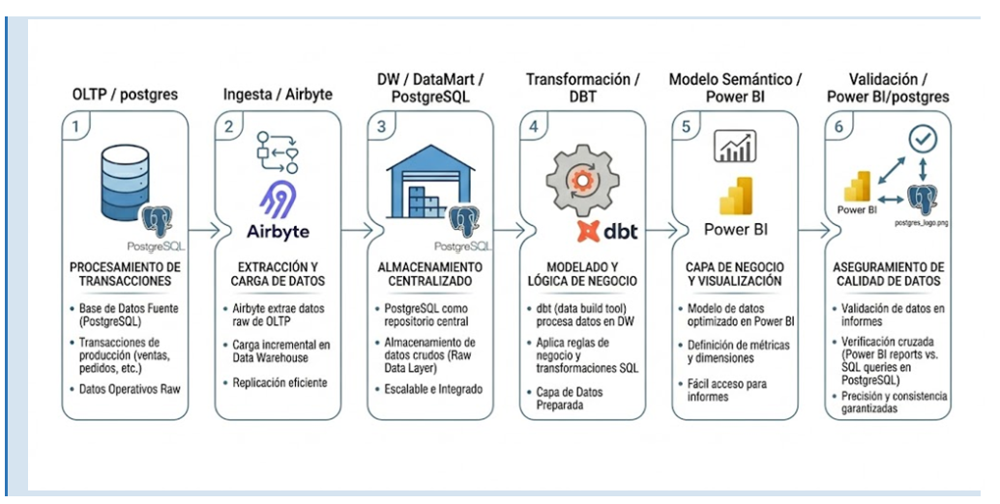

# Arquitectura e Ingesta

## 5. Arquitectura BI implementada

La solucion separa fisicamente la operacion transaccional del consumo analitico. El OLTP PostgreSQL conserva ventas, clientes, productos, produccion, compras y gastos; el DW PostgreSQL expone capas `raw`, `staging` y `marts`; dbt transforma los datos hacia dimensiones y hechos; Power BI consume el esquema `marts`.

| Capa | Tecnologia / ubicacion | Puerto | Descripcion |
| --- | --- | ---: | --- |
| OLTP | PostgreSQL 15, contenedor `postgres_bi`, base `muebleria_db` | 5433 | Sistema transaccional normalizado para ventas, produccion, materiales y gastos |
| Raw | PostgreSQL DW, esquema `raw` | 5434 | Replica o carga cruda de tablas origen para preservar trazabilidad |
| Staging | dbt, `transform/models/staging` | - | Limpieza, casteo, renombrado y estandarizacion de campos |
| Marts | dbt, `transform/models/marts` | - | Modelo estrella con `dim_fecha`, `dim_producto`, `dim_cliente` y `fact_ventas` |
| Dashboard | Power BI, `Powerbi/S4 Muebleria v1.pbix` | - | Modelo semantico, medidas DAX y visualizacion interactiva |



### 5.2 Componentes implementados

| Componente | Descripcion | Estado | Evidencia |
| --- | --- | --- | --- |
| Base transaccional OLTP | Tablas normalizadas de ventas, clientes, productos, materiales, produccion y gastos | Completo | `OLTP-Postgre/base_datos_transaccional.sql` |
| Ingesta | Replicacion hacia `raw`; documentada como Airbyte/dbt y actualmente soportada por scripts/proyecto | Parcial | `transform/models/staging/_sources.yml` |
| Capa raw | Fuentes dbt declaradas para ventas, cliente, producto, tipo_cliente, tipo_venta, material, compra y gasto | Completo para modelado | `sources: raw` |
| Capa staging | Modelos `stg_ventas`, `stg_clientes`, `stg_productos`, `stg_tipo_cliente`, `stg_tipo_venta` | Completo | `transform/models/staging` |
| Capa marts | Dimensiones y hecho central de ventas | Completo | `transform/models/marts` |
| Modelo semantico | Relaciones 1:* desde dimensiones hacia `fact_ventas` | Completo | Power BI y documentacion del informe |
| Dashboard | Pestañas DAX, OLAP, Detalle Producto, Detalle Cliente y TT Ventas | Completo a nivel de archivo PBIX | `Powerbi/S4 Muebleria v1.pbix` |

## 6. Fuente transaccional OLTP

### 6.1 Estructuras utilizadas

| Tabla OLTP | Campos principales | Tipos relevantes | Uso analitico |
| --- | --- | --- | --- |
| `tb_clientes` / `cliente` | `id`, `tipo_cliente_id`, `documento`, `nombre`, `limite_credito`, `saldo_pendiente`, `estado` | `SERIAL`, `VARCHAR`, `NUMERIC`, `TIMESTAMPTZ` | Segmentacion retail/mayorista, canal, credito y comportamiento de clientes |
| `tb_productos` / `producto` | `id`, `nombre`, `costo_estandar`, `precio_venta_retail`, `precio_venta_mayorista` | `SERIAL`, `VARCHAR`, `NUMERIC(10,2)` | Rentabilidad y ranking de productos de melamina |
| `venta` | `fecha`, `cliente_id`, `producto_id`, `cantidad`, `precio_unitario`, `total_venta`, `tipo_venta_id` | `DATE`, `INT`, `NUMERIC(12,2)` | Hecho comercial principal |
| `detalle_venta` | No se implementa como tabla separada; el detalle esta en cada fila de `venta` | - | Grano por linea de venta |
| `tb_usuarios` / `usuario` | `id`, `nombre`, `email`, `rol`, `activo` | `SERIAL`, `VARCHAR`, `BOOLEAN` | Auditoria y responsable de registro |

### 6.2 Script SQL de verificacion

```sql
SELECT 'cliente' AS tabla, COUNT(*) AS registros FROM transaccional.cliente
UNION ALL
SELECT 'producto', COUNT(*) FROM transaccional.producto
UNION ALL
SELECT 'venta', COUNT(*) FROM transaccional.venta
UNION ALL
SELECT 'usuario', COUNT(*) FROM transaccional.usuario
UNION ALL
SELECT 'material', COUNT(*) FROM transaccional.material;
```

Resultado esperado para la carga base deterministica:

| Tabla | Registros esperados | Observacion |
| --- | ---: | --- |
| `cliente` | 4 | 2 retail y 2 mayoristas |
| `producto` | 4 | Ropero, Velador, Comoda, Comodin |
| `venta` | 31 | Ventas de marzo 2026 |
| `usuario` | 4 | Admin, vendedor, produccion y contador |
| `material` | 9 | Melamina, accesorios y componentes |

### 6.3 Verificacion financiera de origen

```sql
SELECT
    COUNT(*) AS transacciones,
    SUM(cantidad) AS unidades,
    SUM(total_venta) AS ventas_totales
FROM transaccional.venta
WHERE fecha BETWEEN DATE '2026-03-01' AND DATE '2026-03-31';
```

| Metrica | Valor real |
| --- | ---: |
| Transacciones | 31 |
| Unidades | 109 |
| Ventas totales | S/ 40,730.00 |

