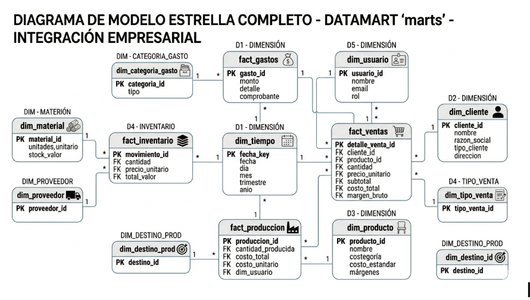

# Modelo Estrella y dbt

## 7. Modelo dimensional propuesto

El DataMart usa un esquema estrella porque el analisis principal parte de una tabla de hechos de ventas y varias dimensiones descriptivas. Esta estructura simplifica la consulta desde Power BI, reduce joins complejos para el usuario final y permite agregaciones directas por tiempo, producto y cliente.

El grano analitico de `fact_ventas` es una linea de venta: una combinacion de fecha, producto, cliente, cantidad, precio unitario y tipo de venta. Con ese grano se pueden responder preguntas de margen, ticket promedio, volumen, participacion por producto y comportamiento por segmento.

| Tabla | Tipo | PK | FK | Atributos reales de la muebleria | Uso |
| --- | --- | --- | --- | --- | --- |
| `fact_ventas` | Hechos | Sin PK tecnica en dbt; grano por linea de venta | `idfecha`, `idproducto`, `idcliente` | `cantidad`, `preciounitvta`, `importetotal`, `tipoventa`, `costomattotal`, `costomototal`, `margencontrib`, `pctmargen`, `es_temporada` | KPIs comerciales y rentabilidad |
| `dim_producto` | Dimension | `idproducto` | - | `cdproducto`, `dsproducto`, `cdcategoria`, `precioventa`, `costomaterial`, `costomanoobra`, `es_estrella` | Analisis de roperos, comodas, veladores y comodines |
| `dim_cliente` | Dimension | `idcliente` | - | `cdcliente`, `nombre`, `documento`, `tipocliente`, `canal`, `limite_credito`, `saldo_pendiente`, `estado` | Segmentacion retail/mayorista |
| `dim_fecha` / `d_tiempo` | Dimension | `idfecha` | - | `fecha`, `dia`, `mes`, `mesnombre`, `trimestre`, `anio`, `temporada`, `es_pico` | OLAP temporal y comparativos |



## 7.1 Transformaciones dbt staging

Las capas staging leen desde `raw`, renombran columnas y estabilizan los contratos que luego consumen los marts.

```sql
WITH source AS (
    SELECT * FROM {{ source('raw', 'venta') }}
)

SELECT
    id              AS venta_id,
    fecha,
    cliente_id,
    tipo_cliente_id,
    producto_id,
    cantidad,
    precio_unitario,
    total_venta,
    tipo_venta_id,
    usuario_id,
    created_at
FROM source
```

```sql
WITH source AS (
    SELECT * FROM {{ source('raw', 'cliente') }}
)

SELECT
    id              AS cliente_id,
    tipo_cliente_id,
    documento,
    TRIM(nombre)    AS nombre,
    razon_social,
    direccion,
    telefono,
    email,
    limite_credito,
    saldo_pendiente,
    estado,
    created_at
FROM source
```

## 7.2 Transformaciones dbt marts

### Dimension producto

```sql
WITH productos AS (
    SELECT * FROM {{ ref('stg_productos') }}
)

SELECT
    producto_id                                             AS idproducto,
    UPPER(REPLACE(nombre, ' ', '_'))                        AS cdproducto,
    nombre                                                  AS dsproducto,
    'Mueble de Melamina'                                    AS cdcategoria,
    COALESCE(precio_venta_retail, precio_venta_mayorista)   AS precioventa,
    costo_estandar                                          AS costomaterial,
    0                                                       AS costomanoobra,
    FALSE                                                   AS es_estrella
FROM productos
ORDER BY nombre
```

### Hecho de ventas

```sql
WITH ventas AS (
    SELECT * FROM {{ ref('stg_ventas') }}
),
clientes AS (
    SELECT * FROM {{ ref('dim_cliente') }}
),
productos AS (
    SELECT * FROM {{ ref('dim_producto') }}
),
fechas AS (
    SELECT * FROM {{ ref('dim_fecha') }}
),
tipo_venta AS (
    SELECT * FROM {{ ref('stg_tipo_venta') }}
)

SELECT
    f.idfecha,
    p.idproducto,
    c.idcliente,
    v.cantidad,
    v.precio_unitario AS preciounitvta,
    v.total_venta     AS importetotal,
    tv.tipoventa,
    ROUND(COALESCE(p.costomaterial, 0) * v.cantidad, 2) AS costomattotal,
    ROUND(COALESCE(p.costomanoobra, 0) * v.cantidad, 2) AS costomototal,
    NULL::NUMERIC(10,2) AS costoalmacen,
    ROUND(
        v.total_venta
        - COALESCE(p.costomaterial, 0) * v.cantidad
        - COALESCE(p.costomanoobra, 0) * v.cantidad,
        2
    ) AS margencontrib,
    CASE WHEN v.total_venta > 0
        THEN ROUND((
            v.total_venta
            - COALESCE(p.costomaterial, 0) * v.cantidad
            - COALESCE(p.costomanoobra, 0) * v.cantidad
        ) / v.total_venta * 100, 2)
        ELSE 0
    END AS pctmargen,
    NULL::INT AS diasentienda,
    NULL::BOOLEAN AS es_ocioso,
    NULL::NUMERIC(10,2) AS costocioso,
    f.es_pico AS es_temporada
FROM ventas v
JOIN fechas f ON f.idfecha = CAST(TO_CHAR(v.fecha, 'YYYYMMDD') AS INT)
JOIN productos p ON p.idproducto = v.producto_id
JOIN clientes c ON c.idcliente = v.cliente_id
LEFT JOIN tipo_venta tv ON tv.tipo_venta_id = v.tipo_venta_id
```

## 7.3 Costos operativos y campos de control

| Campo | Regla implementada / documentada | Estado |
| --- | --- | --- |
| `costomattotal` | `costomaterial * cantidad` | Implementado en `fact_ventas.sql` |
| `costomototal` | `costomanoobra * cantidad`; hoy `costomanoobra = 0` en `dim_producto` dbt | Implementado con valor base cero |
| `costoalmacen` | Campo reservado para distribuir alquiler/local/servicios | Pendiente de parametrizar |
| `costocioso` | Campo reservado para stock ocioso y dias en tienda | Pendiente de regla final |
| `margencontrib` | `importetotal - costomattotal - costomototal` | Implementado |
| `pctmargen` | `margencontrib / importetotal * 100` | Implementado |

## 7.4 Ventas por producto del DataMart base

| Producto | Unidades | Ventas | Margen contribucion |
| --- | ---: | ---: | ---: |
| Ropero | 39 | S/ 29,130.00 | S/ 24,255.00 |
| Comoda | 10 | S/ 4,800.00 | S/ 3,950.00 |
| Velador | 50 | S/ 4,500.00 | S/ 3,100.00 |
| Comodin | 10 | S/ 2,300.00 | S/ 1,950.00 |
| **Total** | **109** | **S/ 40,730.00** | **S/ 33,255.00** |

